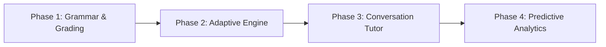

# Product Requirements Document (PRD)
## Buku Kerja Interaktif — Interactive Workbook

**Version:** 1.0  
**Last Updated:** 2026-02-21  
**Author:** Fadly Zaki

---

## 1. Overview

Buku Kerja Interaktif (Interactive Workbook) is a web-based, bilingual (Indonesian/English) learning platform designed for secondary school students. It combines structured English conversation lessons with gamified progress tracking via Duolingo integration.

### 1.1 Problem Statement

Traditional English workbooks lack interactivity, real-time progress tracking, and personalized feedback. Students struggle with motivation, and teachers have no centralized way to monitor individual performance across activities.

### 1.2 Solution

A single-page web application that delivers 8 learning units with interactive exercises, saves student data to Firebase in real-time, and provides teachers with a dashboard for manual grading and observation.

---

## 2. Target Users

| User | Description |
|------|-------------|
| **Students** | Secondary school students (Kelas 7–11) learning conversational English |
| **Teachers** | English tutors ("Rumbel Geera" / "Bilingual" class instructors) managing student progress |

---

## 3. Core Features

### 3.1 Student Experience

| Feature | Description |
|---------|-------------|
| **Student Registration** | Dropdown-based name & class selection (no password required) |
| **Bilingual Toggle** | Full Indonesia ↔ English language switch across all content |
| **Pre-Test & Post-Test** | 30-question multiple-choice assessments saved to Firestore |
| **Motivation Questionnaire** | 12-question Likert-scale survey measuring intrinsic/extrinsic motivation |
| **8 Learning Units** | Each unit includes: Sing Along (YouTube), Vocabulary, Dialogue, Speaking Practice, Duolingo Play, Self Reflection |
| **Progress Tracker** | XP & Streak tracking per session with Chart.js visualization |
| **Duolingo Integration** | XP/Streak input fields linked to Duolingo for Schools (code: `wuyzyz`) |

### 3.2 Teacher Experience

| Feature | Description |
|---------|-------------|
| **Teacher Mode** | Password-protected mode with additional controls |
| **Manual Grading** | Per-section score inputs (vocabulary, dialogue, interview) |
| **Report Dashboard** | Add entries for student progress with XP, streak, grade, and comments |
| **Pre/Post-Test Dashboard** | Visual comparison of pre-test and post-test scores per student |

### 3.3 Unit Structure (×8 Units)

Each unit follows a consistent 6-step pedagogical flow:

1. 🎵 **Sing Along** — YouTube-embedded song with listening tasks
2. 📚 **New Vocabulary** — 4 words with emoji icons + sentence-writing exercises
3. 💬 **Dialogue Example** — Scripted conversation for reading comprehension
4. 🤝 **Speaking Practice** — Peer interview questions with text input
5. 📱 **Duolingo Play** — App-based challenges with XP/Streak tracking
6. ⭐ **Self Reflection** — 5-star confidence rating

### 3.4 Unit Topics

| Unit | Topic (ID) | Topic (EN) |
|------|-----------|-----------|
| 1 | Orientasi & Pengaturan Duolingo | Orientation & Duolingo Setup |
| 2 | Perkenalan Diri | Introducing Myself |
| 3 | Rutinitas Harian | Daily Routines |
| 4 | Kehidupan Sekolah | School Life |
| 5 | Makanan & Minuman | Food & Drinks |
| 6 | Hobi & Waktu Luang | Hobbies & Free Time |
| 7 | Tempat di Kota | Places in Town |
| 8 | Ulasan & Perpisahan | Review & Farewell |

---

## 4. Technical Architecture

### 4.1 Stack

| Layer | Technology |
|-------|-----------|
| **Frontend** | Vanilla HTML/JS (single-file SPA), TailwindCSS (CDN), Chart.js |
| **Backend** | Firebase (Firestore, Anonymous Auth) |
| **Hosting** | Firebase Hosting |
| **Fonts** | Google Fonts (Poppins, Nunito) |

### 4.2 Data Model (Firestore)

```
students/{studentId}/
  ├── tests/preTest      — Pre-test answers
  ├── tests/postTest     — Post-test answers
  ├── tests/motivation   — Motivation questionnaire
  ├── tests/intensity    — Intensity questionnaire
  └── tracker/           — XP/Streak session snapshots

teacherReports/          — Manual grading entries
teacherScores/           — Per-section scores
teacherObservations/     — Observation notes
```

### 4.3 Authentication

- **Students:** Anonymous Auth (auto-generated UID)
- **Teachers:** Password-protected prompt (configured in application)

---

## 5. Non-Functional Requirements

| Requirement | Target |
|-------------|--------|
| **Responsiveness** | Mobile-first, works on student smartphones |
| **Offline** | Not required (Firebase-dependent) |
| **Performance** | < 3s initial load on 3G |
| **Accessibility** | Bilingual support (ID/EN toggle) |
| **Browser Support** | Modern browsers (Chrome, Safari, Firefox) |

---

## 6. AI Capabilities (Planned)

### 6.1 AI Conversation Tutor

| Feature | Description | Priority |
|---------|-------------|----------|
| **Chat-Based Speaking Practice** | AI-powered chatbot that simulates real English conversations, replacing static dialogue scripts with dynamic, context-aware responses | 🔴 High |
| **Pronunciation Feedback** | Speech-to-text with AI scoring on pronunciation accuracy, fluency, and intonation | 🟡 Medium |
| **Grammar Correction** | Real-time grammar suggestions on student-written sentences (vocabulary exercises) | 🔴 High |

### 6.2 Adaptive Learning Engine

| Feature | Description | Priority |
|---------|-------------|----------|
| **Personalized Difficulty** | AI adjusts question difficulty based on pre-test scores and unit performance | 🔴 High |
| **Smart Unit Recommendations** | Suggests which unit to revisit based on weak areas detected from assessment data | 🟡 Medium |
| **Vocabulary Spaced Repetition** | AI schedules vocabulary review using spaced repetition algorithms (SM-2) | 🟡 Medium |

### 6.3 Automated Assessment

| Feature | Description | Priority |
|---------|-------------|----------|
| **Auto-Grading Written Responses** | AI evaluates free-text sentence examples for grammar, relevance, and creativity | 🔴 High |
| **Pre/Post-Test Analytics** | AI-generated insights comparing pre vs. post-test performance with per-student commentary | 🟡 Medium |
| **Learning Progress Predictions** | ML model predicting student outcomes based on engagement patterns (XP, streak, time-on-task) | 🟢 Low |

### 6.4 AI-Powered Teacher Tools

| Feature | Description | Priority |
|---------|-------------|----------|
| **Auto-Generated Reports** | AI summarizes individual student performance into narrative report cards | 🔴 High |
| **Class-Wide Insights** | Dashboard with AI-detected patterns (e.g., "70% of students struggle with Unit 5 vocabulary") | 🟡 Medium |
| **Content Generation** | AI generates new dialogue scripts, vocabulary exercises, and quiz questions per unit theme | 🟡 Medium |
| **Observation Suggestions** | AI recommends focus areas for teacher observation based on student data | 🟢 Low |

### 6.5 Implementation Approach



| Phase | Scope | Tech |
|-------|-------|------|
| **Phase 1** | Grammar correction + auto-grading written responses | OpenAI API / Gemini API |
| **Phase 2** | Personalized difficulty + spaced repetition | Firebase ML + custom logic |
| **Phase 3** | AI conversation tutor with speech input | Web Speech API + LLM |
| **Phase 4** | Predictive analytics + auto-generated reports | Vertex AI / BigQuery ML |

---

## 7. MVP Data Utilization Strategy (Pre-Test & Post-Test)

Leveraging existing MVP data from real users allows for immediate validation and accelerated development of analytical features:

1. **Visual Analytics Dashboard:** Immediately build the Teacher Report Dashboard (Section 3.2) using existing data to visualize individual growth (pre vs. post-test) and class-wide trends via Chart.js.
2. **AI Pre/Post-Test Analytics:** Use MVP data to build and test the prompt logic for AI-generated insights (Section 6.3). The AI will provide personalized commentary (e.g., specific student weaknesses) and class-wide insights.
3. **Prompt Fine-Tuning:** Utilize the dataset as a reliable benchmark to systematically test and refine AI prompts, ensuring pedagogical feedback is high-quality and teacher-like.
4. **Adaptive Learning Jumpstart:** Analyze patterns in the MVP data (e.g., commonly failed topics) to begin designing the rules and logic for the Smart Unit Recommendations (Section 6.2).

---

## 8. Future Considerations

- [ ] Individual student login with proper authentication
- [ ] Offline mode with service worker caching
- [ ] Audio pronunciation for vocabulary words
- [ ] Automated pre/post-test scoring and comparison
- [ ] Export student reports as PDF
- [ ] Push notification reminders for Duolingo streaks
